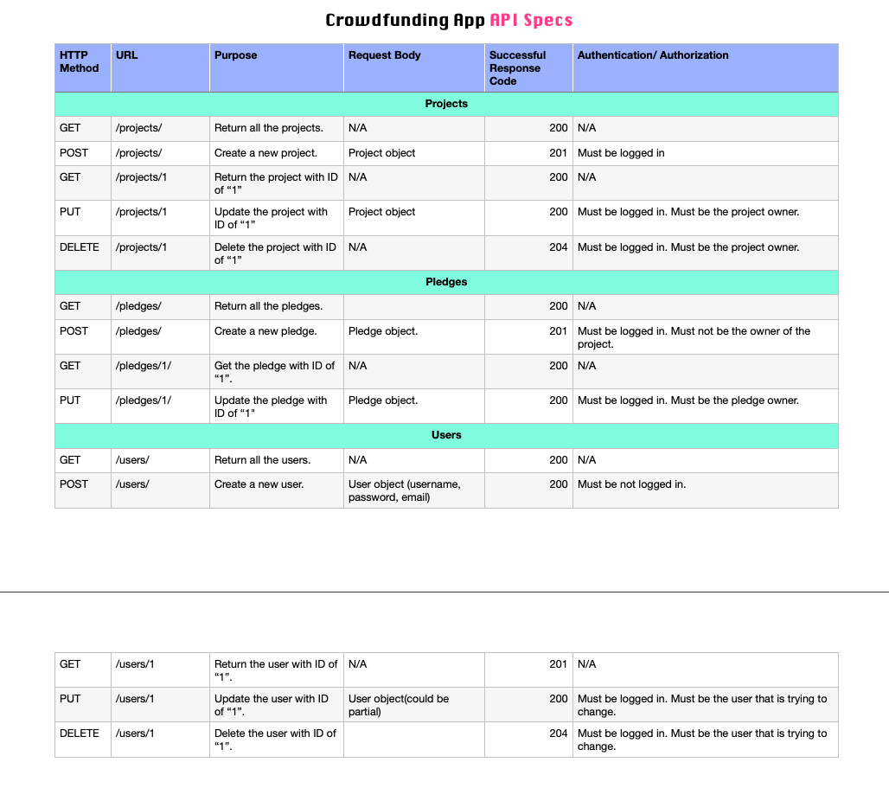
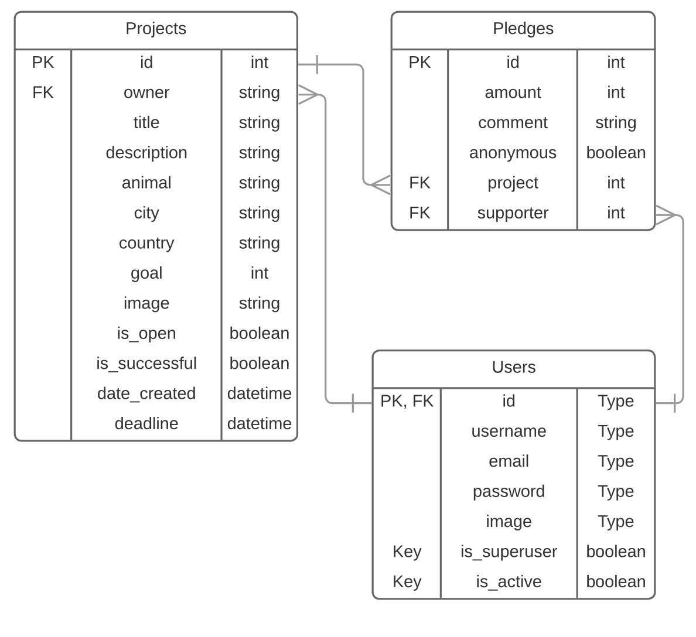
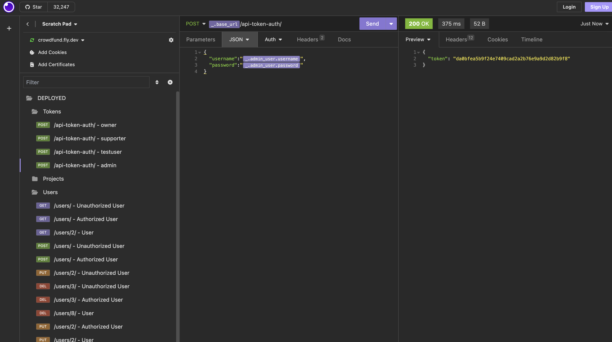
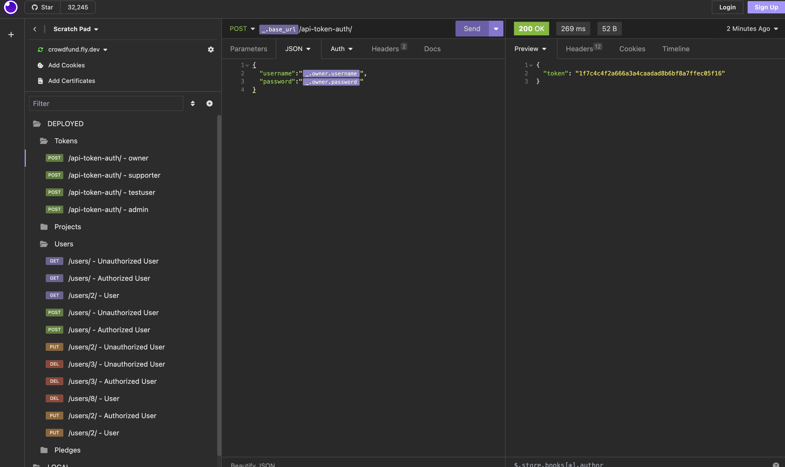
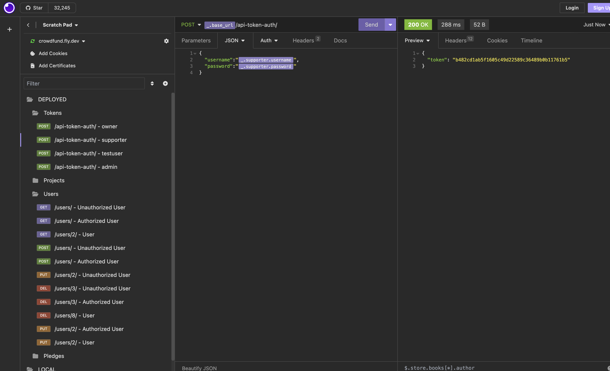
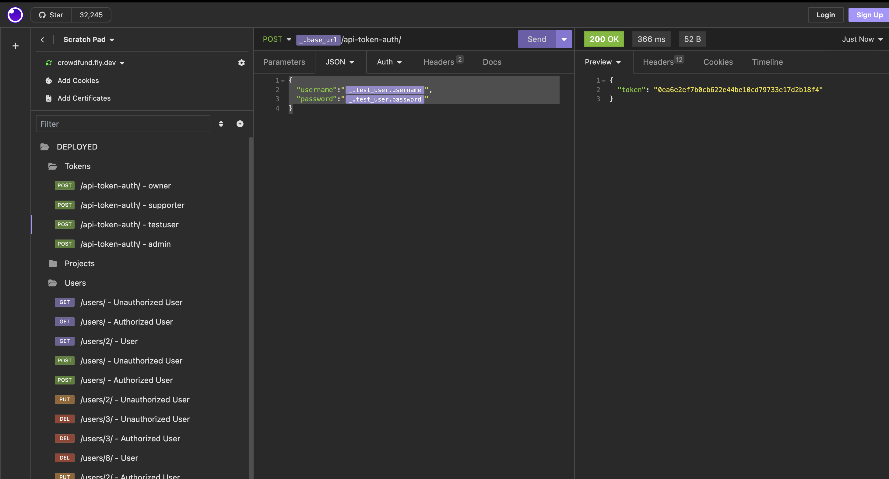
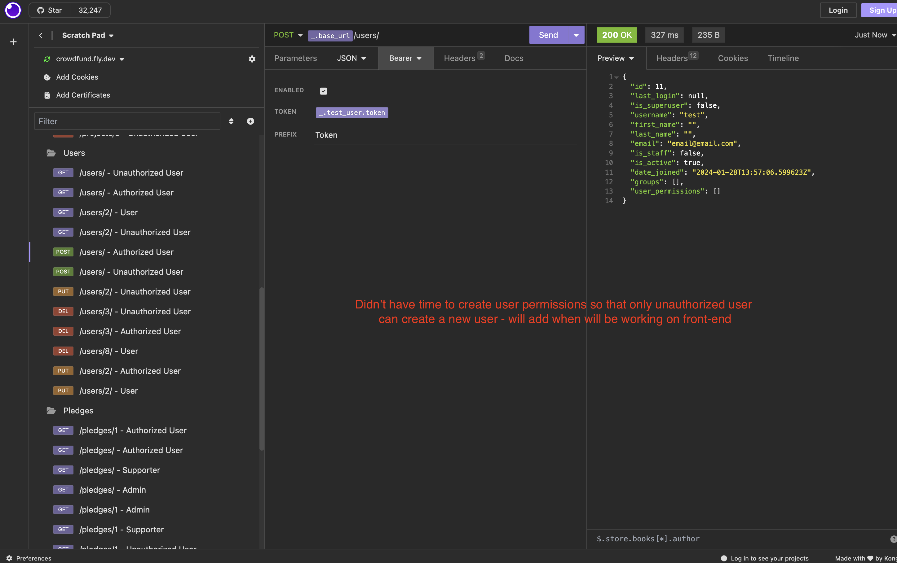
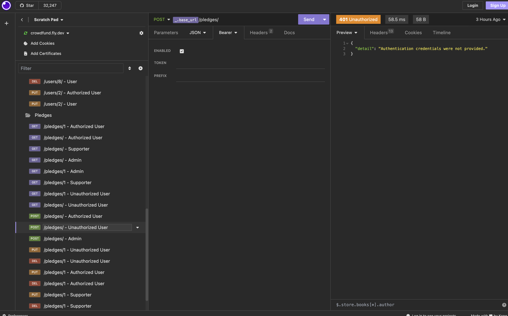
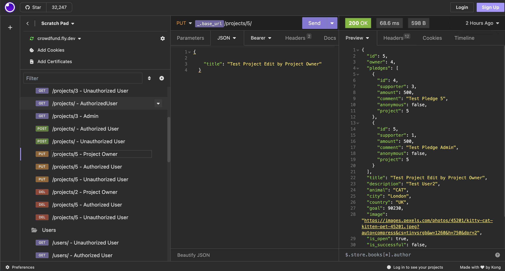

# crowdfunding_back_end

# Crowdfunding Back End
Anya Belkina
## Planning:
### Concept/Name
This is an animal fundraising web-site. Join our community to support various animal welfare projects, create personalized campaigns, and make a real impact on the lives of animals in need. Together, let's create a world where every paw lives the best lives and finds a loving home.
### Intended Audience/User Stories
For people who want to raise money to support animals. They can create a campaigne to raise money for medical bills, homestay or food. People from all over the world can donate money to help the little furry friends. You can also search all the animals that are located in a specific city.
### Front End Pages/Functionality
- {{ A page on the front end }}
- {{ A list of dot-points showing functionality is available on this page }}
- {{ etc }}
- {{ etc }}
- {{ A second page available on the front end }}
- {{ Another list of dot-points showing functionality }}
- {{ etc }}
### API Spec

| | | | | | |
### DB Schema

### API Tokens

### GET Method Examples

### POST Method Examples

### PUT Method Examples

### DELETE Method Examples

