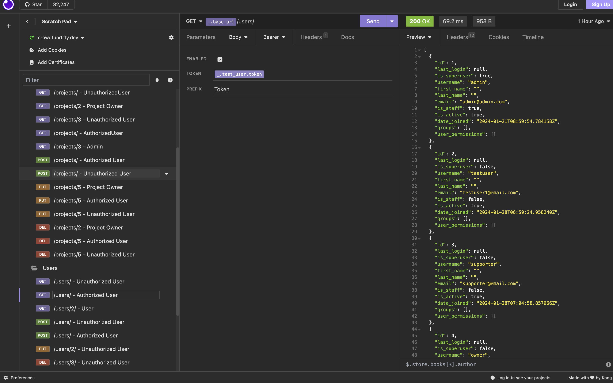
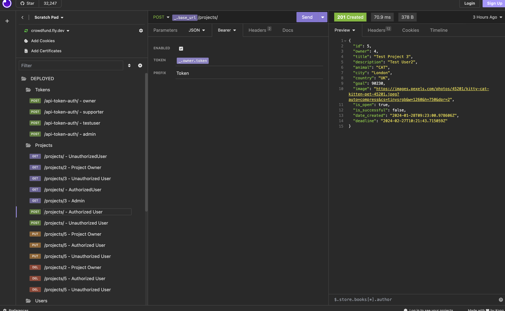
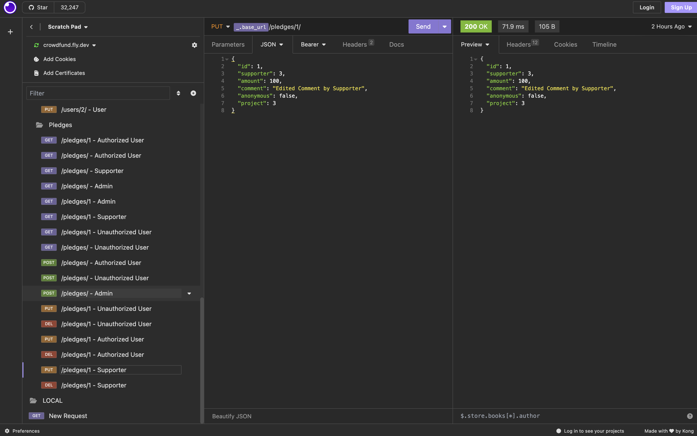

# crowdfunding_back_end

# Crowdfunding Back End
Anya Belkina
https://crowdfund.fly.dev/

## Planning:
### Concept/Name
This is an animal fundraising web-site. Join our community to support various animal welfare projects, create personalized campaigns, and make a real impact on the lives of animals in need. Together, let's create a world where every paw lives the best lives and finds a loving home.
### Intended Audience/User Stories
For people who want to raise money to support animals. They can create a campaigne to raise money for medical bills, homestay or food. People from all over the world can donate money to help the little furry friends. You can also search all the animals that are located in a specific city.
### Front End Pages/Functionality
- {{ A page on the front end }}
- {{ A list of dot-points showing functionality is available on this page }}
- {{ etc }}
- {{ etc }}
- {{ A second page available on the front end }}
- {{ Another list of dot-points showing functionality }}
- {{ etc }}
### API Spec

| | | | | | |
### DB Schema


### API Tokens Generation Examples


### GET Method Examples



### POST Method Examples



### PUT Method Examples



### Instructions for Insomnia:
#### - Create a new user 

1) User must not be authorized
2) Create a new POST HTTP Request 
3) URL: https://crowdfund.fly.dev/users/
4) Select JSON as the Body input format
5) Required fields:
```
{
		"username": "{enter your username}",
		"password": "{enter your password}",
		"email": "{enter your email}"
	}
```
If request is successful a 200 status code is returned and new user is created.
If you try to create a user while being logged in you will get a 403 Status Code and message saying "You are already logged in."

#### - Generate an Auth Token
1) Create a new POST HTTP Request 
2) URL: https://crowdfund.fly.dev/users/api-token-auth/
3) Select JSON as the Body input format
4) In the body enter the username and password of a user you want to generate a token for
    ```
    {
		"username": "{enter user's username}",
		"password" : "{enter user's password}"
	}
    ```
5)  Click Send and you will see a token. (Copy this to use for authentication purposes)

#### - Authentication

In order to imitate different users with different permission types we need to pass the user's token (generated in the previous step) into Authentication tab of the request.
1) Select Bearer Token as Auth Type
2) Pass the user token generted from the previous step for authentication
3) In the prefix field put "Token"
After this is done you can send the request on behalf of that user.


#### - Create a new project 

1) User must be logged in
2) Create a new POST HTTP Request 
3) URL: https://crowdfund.fly.dev/projects/
4) Required fields:
   ```
{
	
	"title": "{project title}",
	"description": "{project description}",
    "animal": "{choose one of the options: CAT, DOG, BIRD, HORSE}"
	"goal": "{Goal amount}",
    "city":"{the city this animal is located}",
    "country":"{the country this animal is located}",
	"image": "{url of image}"

}

If request is successful a 201 status code is returned and new project is created.

Default fields:
'id' - created automatically (Read Only)
'owner' - set to User's ID (Read Only)
'date_created' - set to now() (Read Only)
'deadline' - set to one month after the 'date_created'
'is_active' - set to True
'is_successful' - set to False
Fields that are NOT Read Only can be chnaged via PUT HTTP Request or set during the creation


#### - Create a new pledge

1) User must be logged in 
2) Create a new POST HTTP Request 
3) URL: https://crowdfund.fly.dev/pledges/
4) Required fields:
```
{
	"amount":	"{amount to donate}",
	"comment": "{comment to the pledge}",
	"project": "{ID of a project you donate to}"	
}
```
Default fields:
'id' - created automatically (Read Only)
'supporter' - set to User's ID (Read Only)
'anonymous' - False
Fields that are NOT Read Only can be chnaged via PUT HTTP Request or set during the creation